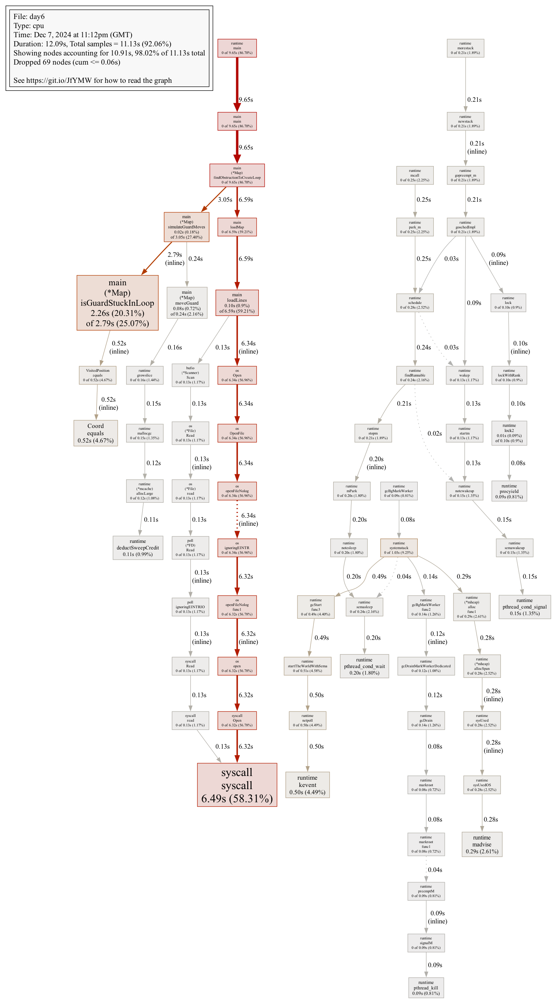
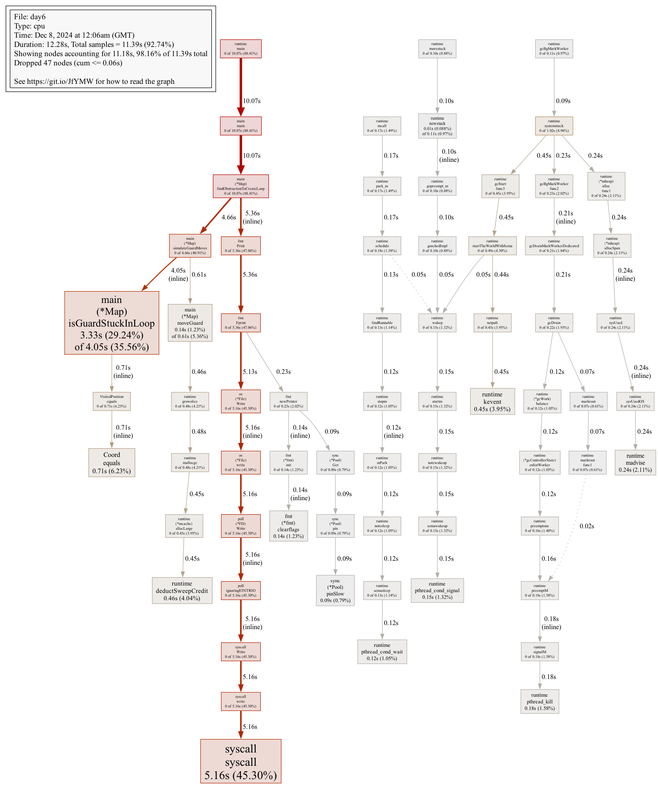

This year for the first time, I decided to take part in Advent of code. I had tried a few of the puzzles in previous years but never during December, and I never got particuarly far. I thought it was an apt to use it as an excuse to become better familiar with Go, my latest distraction from my usual comfort zone of Python/Javascript. While I have never been close to making it onto the leaderboard it has been a lot of fun so far, and avoiding using Copilot has been a fun exercise too.

Day 6 of this years advent of code was the first time I found myself wondering if my code was stuck in a loop before it finally finished. Part 1 was fine; it involved simulating the path of a guard taking a walk through a room full of obstacles, walking in a straight line until she finds something in her way. At that point she turns 90 degrees and continues walking straight. All we had to do was calculate how long it would be until she wondered off the map we had been given.

However part 2 made things slightly more complicated. If we could place a single new obstacle somewhere, could we get the guard stuck in a loop? How many possible places are there to trigger this behaviour?

Before I even started, I noted down a few thoughts. Firstly I noticed that we only had to check along the original path of the guard. Any obstacle placed anywhere else would have no effect. This drastically shrink the number of possibile places I needed to check.

As for loop detection, if I could keep a log of all the positions the guard had been on her current walk, all I would have to do to detect if we had entered a loop, was to see if our current position was one we had already been to, and we were pointing the same direction too.

After fixing a few bugs, my code successfully ran the from the example with the correct answer, and so I set my code off on the full problem data. I was used to it returning almost instantly, I frowned slightly when my terminal did not print anything for a few seconds. Perhaps my loop detection had hit an edge case that was not in the example input, and the poor guard was doomed to wonder around in a circle for the rest of eternity. My fingers hovered over the Control and C key but I hesitated. My lack of logging did mean I had no visability into what my code was doing currently. My hesitation was enough, suddenly the program exited with a number, and after submitting it on the site to confirm it was correct, I returned to the code. Why had it taken that long?

First, I added some better logging. A number that could tick up with which simulation it was running confimed that it wasn't getting stuck. But even then (and after building the program to eliminate any compile time slowness), my script was taking over 17 seconds to run!

```
./day6  16.30s user 0.58s system 94% cpu 17.771 total
```

Was my code ineffecient or was this just a problem that required this long to solve? A quick look at the adventofcode subreddit confimed that while most people accepted it was a lot of permutations to check, some others using traditionally slower langauges such as Python were solving it quicker than me. I must have made some rookie mistakes here.

This seemed like a good as excuse as ever to start exploring the built in tooling for profiling Go code, so after skim reading [a dev blog](https://go.dev/blog/pprof), I gave it my own go. As I am new to Go (both writing and profiling it), this blog post may not be the most comprehensive or even correct, I thought it would be a good idea to document what I investigated, and interesting to show what I learned.

## Attaching the profiler.

Go has a built in tool called pprof, and a package in the standard library `runtime/pprof`. It requires adding some code to enable the CPU profiling and while the docs suggest attaching it to a flag, I just added it to the top of my main function.

```
f, err := os.Create("cpuprofile.prof")
if err != nil {
    panic(err)
}
pprof.StartCPUProfile(f)
defer pprof.StopCPUProfile()
```

This will save the profiling data to a file called `cpuprofile.prof` when the application runs. You can then view the data with the following command:

```
go tool pprof cpuprofile.prof
```

This will start an interactive prompt in the pprof tool which we can query to get data from.

## The slow for loop

Firstly, running `top10` shows the top 10 functions which were running for longest.

```
(pprof) top10
Showing nodes accounting for 16300ms, 95.15% of 17130ms total
Dropped 81 nodes (cum <= 85.65ms)
Showing top 10 nodes out of 87
      flat  flat%   sum%        cum   cum%
    6060ms 35.38% 35.38%     8200ms 47.87%  main.(*Map).isGuardStuckInLoop
    4960ms 28.96% 64.33%     4960ms 28.96%  syscall.syscall
    2040ms 11.91% 76.24%     2050ms 11.97%  main.Coord.equals (inline)
    1100ms  6.42% 82.66%     1100ms  6.42%  runtime.deductSweepCredit
     490ms  2.86% 85.52%      490ms  2.86%  fmt.(*fmt).clearflags
     490ms  2.86% 88.38%      490ms  2.86%  runtime.kevent
     410ms  2.39% 90.78%      410ms  2.39%  runtime.pthread_cond_signal
     310ms  1.81% 92.59%      310ms  1.81%  runtime.madvise
     220ms  1.28% 93.87%      220ms  1.28%  runtime.pthread_kill
     220ms  1.28% 95.15%      220ms  1.28%  sync.(*Pool).pinSlow
```

I wasn't too surprised to see my `isGuardStuckInLoop` function right at the top of the list. `Coord.equals` was a bit more of a surprise as it really boils down to a simple boolean expression, but I could come back to that later.

Running `list .isGuardStuckInLoop` was a bit more telling on what was actually wrong.

```
(pprof) list .isGuardStuckInLoop
Total: 17.53s
ROUTINE ======================== main.(*Map).isGuardStuckInLoop in /Users/toby/Documents/Personal Projects/AdventOfCode2024/day6/main.go
     7.70s     10.31s (flat, cum) 58.81% of Total
         .          .    161:func (m *Map) isGuardStuckInLoop() bool {
         .          .    162:   if len(m.guard.visitedPositions) == 0 {
         .          .    163:           // Guard hasn't gone anywhere yet
         .          .    164:           return false
         .          .    165:   }
         .          .    166:   currentPosition := m.guard.visitedPositions[len(m.guard.visitedPositions)-1]
     6.74s      6.76s    167:   for i, pos := range m.guard.visitedPositions {
     960ms      980ms    168:           if i >= len(m.guard.visitedPositions)-1 {
         .          .    169:                   break
         .          .    170:           }
         .          .    171:
         .      2.57s    172:           if pos.equals(currentPosition) {
         .          .    173:                   return true
         .          .    174:           }
         .          .    175:   }
         .          .    176:   return false
         .          .    177:}
```

Almost 1 second spent checking if we were at the last element of the list, all because I was too lazy to trim the array. Should be an easy fix.

My first thought was to swap from using the range function to a simple index, and load the position at that index manually. I could easily just change the loop to simply not go all the way to the end then. However that didn't quite have the effect I expected.

```
(pprof) list .isGuardStuckInLoop()
Total: 21.77s
ROUTINE ======================== main.(*Map).isGuardStuckInLoop in /Users/toby/Documents/Personal Projects/AdventOfCode2024/day6/main.go
     8.62s     14.17s (flat, cum) 65.09% of Total
         .          .    161:func (m *Map) isGuardStuckInLoop() bool {
         .          .    162:   if len(m.guard.visitedPositions) == 0 {
         .          .    163:           // Guard hasn't gone anywhere yet
         .          .    164:           return false
         .          .    165:   }
      10ms       10ms    166:   currentPosition := m.guard.visitedPositions[len(m.guard.visitedPositions)-1]
         .          .    167:
     2.03s      2.04s    168:   for i := 0; i < len(m.guard.visitedPositions)-1; i++ {
     6.57s      6.62s    169:           pos := m.guard.visitedPositions[i]
         .          .    170:
         .      5.49s    171:           if pos.equals(currentPosition) {
         .          .    172:                   return true
         .          .    173:           }
         .          .    174:   }
      10ms       10ms    175:   return false
         .          .    176:}
```

Ok so range is better than manually doing the same thing. In hindsight, perhaps that should have been obvious. Instead lets just cut the slice down to the length we actually need.

I could already tell when I ran the application that this was faster. Even with the added overhead of the profiler, we were down to just under 15 seconds!

```
go run .  12.67s user 0.99s system 102% cpu 13.305 total
```

And the new function:

```
(pprof) list .isGuardStuckInLoop()
Total: 11.66s
ROUTINE ======================== main.(*Map).isGuardStuckInLoop in /Users/toby/Documents/Personal Projects/AdventOfCode2024/day6/main.go
     3.58s      4.18s (flat, cum) 35.85% of Total
         .          .    161:func (m *Map) isGuardStuckInLoop() bool {
         .          .    162:	if len(m.guard.visitedPositions) == 0 {
         .          .    163:		// Guard hasn't gone anywhere yet
         .          .    164:		return false
         .          .    165:	}
         .          .    166:	currentPosition := m.guard.visitedPositions[len(m.guard.visitedPositions)-1]
         .          .    167:
     3.58s      3.59s    168:	for _, pos := range m.guard.visitedPositions[:len(m.guard.visitedPositions)-1] {
         .      590ms    169:		if pos.equals(currentPosition) {
         .          .    170:			return true
         .          .    171:		}
         .          .    172:	}
         .          .    173:	return false
         .          .    174:}
```

## Mysterious syscall

Now looking back at the new top 10:

```
(pprof) top10
Showing nodes accounting for 11.20s, 96.05% of 11.66s total
Dropped 56 nodes (cum <= 0.06s)
Showing top 10 nodes out of 84
      flat  flat%   sum%        cum   cum%
     5.44s 46.66% 46.66%      5.44s 46.66%  syscall.syscall
     3.58s 30.70% 77.36%      4.18s 35.85%  main.(*Map).isGuardStuckInLoop
     0.59s  5.06% 82.42%      0.59s  5.06%  main.Coord.equals (inline)
     0.46s  3.95% 86.36%      0.46s  3.95%  runtime.deductSweepCredit
     0.44s  3.77% 90.14%      0.44s  3.77%  runtime.kevent
     0.17s  1.46% 91.60%      0.17s  1.46%  fmt.(*fmt).clearflags
     0.16s  1.37% 92.97%      0.16s  1.37%  runtime.madvise
     0.13s  1.11% 94.08%      0.13s  1.11%  sync.(*Pool).pinSlow
     0.12s  1.03% 95.11%      0.12s  1.03%  runtime.pthread_cond_wait
     0.11s  0.94% 96.05%      0.58s  4.97%  main.(*Map).moveGuard
```

Syscall has taken the top step. My initial thoughts were that these might be related to printing to standard out. While I didn't think they would have as much of an effect as this, it was an easy thing to check.

I had the following lines I took from Stack Overflow to override the same line in the terminal using funky characters:

```
	fmt.Print("\033[s")
	for i, visitedPosition := range visitedSet {
		fmt.Print("\033[u\033[K")
		fmt.Printf("Simulating object on visited square %d of %d.", i+1, len(visitedSet))
```

That line would be updated nearly 5000 times with the regular puzzle input. However, commenting out the `fmt` lines had no visible effect on the run time, or the top10. It was slightly faster? Although definitely within the margin of error.

```
go run .  12.28s user 0.68s system 105% cpu 12.303 total
```

So I reverted my changes and kept looking. As it turns out, my error was far more egregious than a status a log message but it was not immidiately obvious from the command line terminal what was causing these syscalls. Luckily there exists a web version of the tool you can launch with `go tool pprof -http=127.0.0.1:8888 cpuprofile.prof`. Here you can see different visualisations such as flame charts. However my issue was obvious from the call graph.



Following the line up from the massive syscall box, we hit `os.Open`, and above that `findObstructionToCreateLoop`. I immidiately remember what I did.

To set the scene, I am in the middle of moving into a new house. After an evening of unpacking more boxes, I had sat down at my dining table with my laptop to catch up on AoC. I had no wifi and was hotspotting off my phone to download problem inputs and submit answers, My phone's limited data plan is a good deterant for just googling the answers to my problems.

```
func (m *Map) findObstructionToCreateLoop(filename string) int {
    // ...
    for i, visitedPosition := range visitedSet {
        // ...
		mapCopy := loadMap(filename)
        // ...
```

I knew I needed to create a deep copy of the map, the guard's position and route. From a cursory glance at the standard lib docs (`godoc -http=:6060` is great for when you know you have a limited connection!) there appeared to be no deep copy available. So in a pure moment of laziness, instead of rolling my own, I decided to just reload the state from the input file. For every simulation. It doesn't matter how good my Macbooks SSD is, its always going to be slower than memory.

I hadn't realised it would be doing that just shy of 5000 times when I wrote it, but again in hindsight I should have given it was the answer to the previous part. I'm just thankful I was only running it for the path rather than bruteforcing across the entire map like others were (around 16,900 in the worst case!).

So I had a sigh, made myself another coffee, and wrote the code I should have originally as a punishment to myself out of anything. So imagine my surprise when there was no change to the top 10:

```
(pprof) top10
Showing nodes accounting for 10960ms, 96.22% of 11390ms total
Dropped 47 nodes (cum <= 56.95ms)
Showing top 10 nodes out of 67
      flat  flat%   sum%        cum   cum%
    5160ms 45.30% 45.30%     5160ms 45.30%  syscall.syscall
    3330ms 29.24% 74.54%     4050ms 35.56%  main.(*Map).isGuardStuckInLoop
     710ms  6.23% 80.77%      710ms  6.23%  main.Coord.equals (inline)
     460ms  4.04% 84.81%      460ms  4.04%  runtime.deductSweepCredit
     450ms  3.95% 88.76%      450ms  3.95%  runtime.kevent
     240ms  2.11% 90.87%      240ms  2.11%  runtime.madvise
     180ms  1.58% 92.45%      180ms  1.58%  runtime.pthread_kill
     150ms  1.32% 93.77%      150ms  1.32%  runtime.pthread_cond_signal
     140ms  1.23% 95.00%      140ms  1.23%  fmt.(*fmt).clearflags
     140ms  1.23% 96.22%      610ms  5.36%  main.(*Map).moveGuard
```

At first I assumed I was running the wrong code, or I had the wrong profile selected. But then I loaded the call chart again...



So its the log messages after all? I re-commented them out again and after running that, I've shaved off another .2 of a second but this is hardly the big fish I was hoping for here. At least syscall is now off the top10 now.

```
(pprof) top10
Showing nodes accounting for 9.33s, 94.91% of 9.83s total
Dropped 69 nodes (cum <= 0.05s)
Showing top 10 nodes out of 65
      flat  flat%   sum%        cum   cum%
     4.75s 48.32% 48.32%         6s 61.04%  main.(*Map).isGuardStuckInLoop
     2.27s 23.09% 71.41%      2.27s 23.09%  runtime.kevent
     1.22s 12.41% 83.83%      1.22s 12.41%  main.Coord.equals (inline)
     0.27s  2.75% 86.57%      0.27s  2.75%  runtime.madvise
     0.16s  1.63% 88.20%      0.16s  1.63%  runtime.deductSweepCredit
     0.16s  1.63% 89.83%      0.16s  1.63%  runtime.pthread_cond_wait
     0.15s  1.53% 91.35%      0.15s  1.53%  runtime.pthread_kill
     0.13s  1.32% 92.68%      0.39s  3.97%  main.(*Map).moveGuard
     0.13s  1.32% 94.00%      0.13s  1.32%  runtime.pthread_cond_signal
     0.09s  0.92% 94.91%      0.09s  0.92%  runtime.memclrNoHeapPointers
```

We are back with ol' faithful `isGuardStuckInLoop`

```
(pprof) list .isGuardStuckInLoop
Total: 9.83s
ROUTINE ======================== main.(*Map).isGuardStuckInLoop in /Users/toby/Documents/Personal Projects/AdventOfCode2024/day6/main.go
     4.75s         6s (flat, cum) 61.04% of Total
         .          .    194:func (m *Map) isGuardStuckInLoop() bool {
         .          .    195:	if len(m.guard.visitedPositions) == 0 {
         .          .    196:		// Guard hasn't gone anywhere yet
         .          .    197:		return false
         .          .    198:	}
      20ms       20ms    199:	currentPosition := m.guard.visitedPositions[len(m.guard.visitedPositions)-1]
         .          .    200:
     4.73s      4.76s    201:	for _, pos := range m.guard.visitedPositions[:len(m.guard.visitedPositions)-1] {
         .      1.22s    202:		if pos.equals(currentPosition) {
         .          .    203:			return true
         .          .    204:		}
         .          .    205:	}
         .          .    206:	return false
         .          .    207:}
```

## . chaining efficiency?

## The equals function

> TODO - Rather than checking each tile, only store and check for loops on change of direction to reduce number of checks
